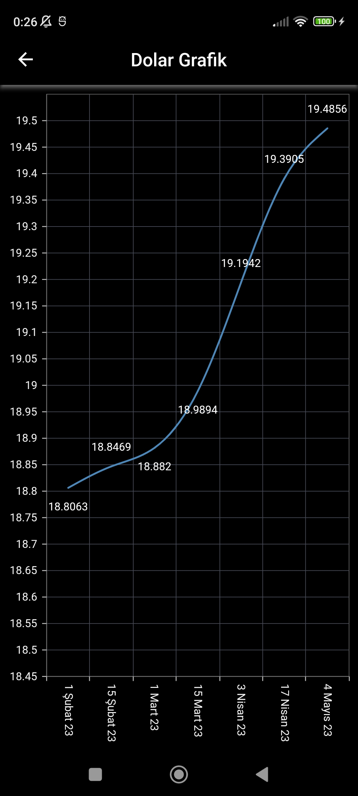
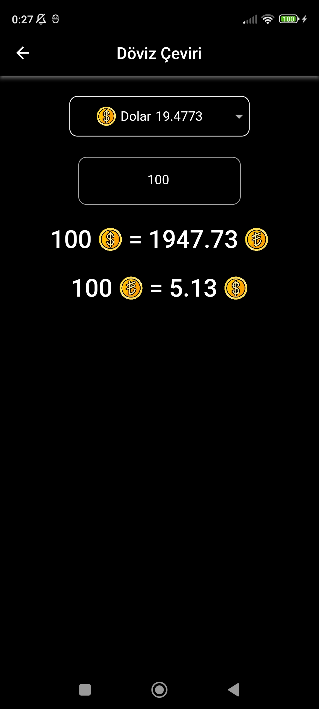

# döviz kurları

**Flutter** kullanarak geliştirmiş olduğum döviz uygulaması. Güncel döviz kurlarını görüntüleyebilir, TL cinsinden karşılığını sorgulayabilirsiniz. Kendi cüzdanınızı oluşturup, kaydedebilirsiniz.

## screenshots

  
  
  
  

## packages

- [Dio](https://pub.dev/packages/dio)
- [Connectivity Plus](https://pub.dev/packages/connectivity_plus)
- [Font Awesome](https://pub.dev/packages/font_awesome_flutter)
- [Url Launcher](https://pub.dev/packages/url_launcher)
- [Shared Preferences](https://pub.dev/packages/shared_preferences)
- [Flutter Bloc](https://pub.dev/packages/flutter_bloc)
- [Syncfusion Flutter Charts](https://pub.dev/packages/syncfusion_flutter_charts)

## api

api: https://api.genelpara.com/embed/para-birimleri.json
